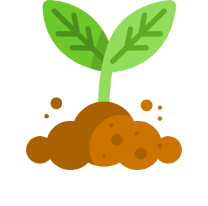
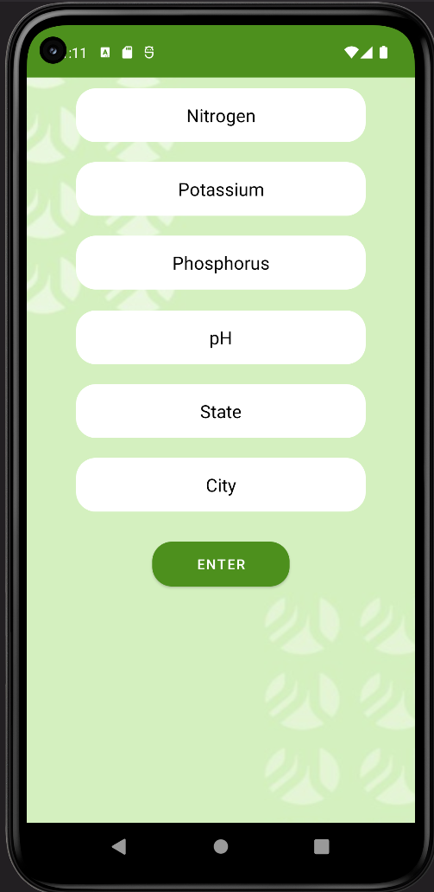

# SoilOCulture

# Soil – O – Culture App



## Overview

The **Soil – O – Culture App** is a Java-based agricultural application that empowers farmers with essential tools and insights for crop management, plant health, and resource optimization. With support for multiple languages, it serves a diverse global farming community.

## Key Features

### Crop Recommender System

- Predicts the best-suited crops based on soil composition (NPK values), humidity, temperature, and more.
- Enables farmers to make informed decisions, optimizing yields and resource utilization.

### Plant Disease Identification

- Upload images of plants to diagnose and address diseases promptly.
- Empowers farmers to take swift and informed action to protect their crops.

### Weather Information

- Provides real-time weather forecasts, including rainfall predictions.
- Aids in efficient water resource management and cost reduction.

## Language Support

The Soil – O – Culture App currently supports the following languages:

1. English
2. Spanish
3. French
4. Hindi
5. Chinese (Simplified)

We welcome contributions from the community to add more languages. Refer to our [Contribution Guidelines](CONTRIBUTING.md) for details.

## Screenshots

  


## Getting Started

1. Clone the repository:

   ```bash
   git clone https://github.com/yourusername/soil-o-culture-app.git
2. Navigate to the project directory:
   ```bash
   cd soil-o-culture-app
3. Build and run the Java application:
   ```bash
   # Example for Maven
   mvn clean install

   # Run the application
   java -jar target/soil-o-culture-app.jar
## Contributing
We invite contributions to enhance the Soil – O – Culture App further. To contribute:

1. Fork the repository.
2. Create a new branch for your feature or bug fix.
3. Make your changes and commit them.
4. Push your changes to your fork.
5. Create a pull request with a descriptive title and detailed description.
Please ensure your code adheres to our coding standards and includes relevant tests.

## License
The Soil – O – Culture App is open-source and licensed under the MIT License. See the LICENSE file for details.

## Contact
If you have questions, suggestions, or encounter issues, please feel free to contact us at your@email.com. We are dedicated to supporting farmers and ensuring their success through this powerful tool.

We appreciate your interest in Soil – O – Culture and hope it proves to be a valuable asset for farmers worldwide.

Happy farming!


   

   

   


   
   
